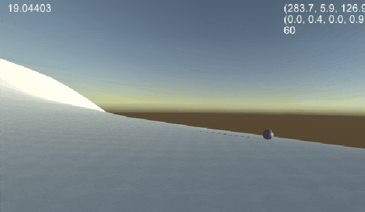
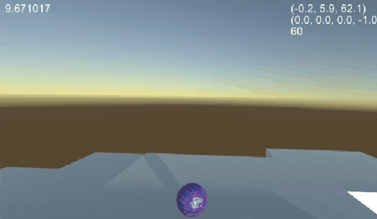
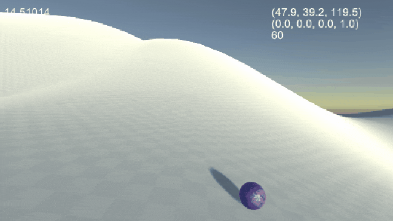

# endless-roller
#### Endless runner-style game with a ball and procedural terrain generation, made in Unity

|  |  |  |
|:----:|:----:|:----:|

## About
Initially a test of infinite procedural terrain generation in Unity, this may turn into a more fleshed-out game in the future. Currently, the game generates terrain around a ball as it moves about, with the option to reset the position of objects to the origin to avoid eventual floating-point precision errors.

## Controls

 WASD - move ball  
Spacebar - jump (hold to increase jump height) 

## How it works
### Terrain Generation
The base generation script, *TerrainGenerator.cs*, is attached to an empty GameObject which may be placed in a scene. It generates terrain tiles around the player (or any other given GameObject), adding more tiles ahead of the player and destroying those behind it to save memory. The script can be passed any GameObject to be used as a terrain tile (see the Perlin noise terrain and cube land above); the behaviour of each terrain tile should be specified in a script attached to that object.

### Camera
The camera is designed to follow the ball quite lazily, keeping it onscreen but not forcing it to be close or central on the screen. This is done via extensive use of lerping, and I think the overall effect is pleasingly dynamic. The camera will also try to stay a certain distance from the terrain at all times.

###### Christopher Kirkham, 2019
